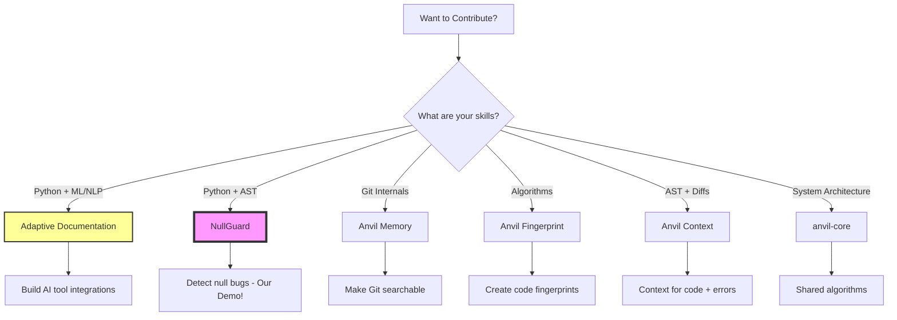

# Contributing to the Anvil Suite

Welcome to the result of **The Great Simplification** - a collection of focused developer tools that actually ship.

## The Anvil Philosophy (Post-Simplification)

After drowning in 50+ documents of research and theory, we learned our lesson:

**Build small tools that do one thing exceptionally well. Ship them quickly.**

No more grand visions. No more overwhelming complexity. Just practical tools that solve real problems.

## Our Approach

1. **Pick one problem** - Each tool solves exactly one developer pain point
2. **Ship in months** - If it takes years, it's too complex
3. **Work independently** - Each tool must be useful standalone
4. **Share foundations** - Common code goes in `anvil-core`
5. **Let usage guide us** - Real developers using real tools drive our roadmap

## 🗺️ Contributor Map



### 🎯 Recommended Starting Points

**New to the project?** → Start with **NullGuard** (our showcase demo)
**Have AI tool experience?** → Help with **Adaptive Documentation** (critical path)
**Love algorithms?** → Dive into **anvil-core** or **Fingerprint**
**Know Git internals?** → **Anvil Memory** needs you

## Choose Your Adventure

### 🎯 The Most Important Project: Adaptive Documentation
**The foundation that powers everything else**

Adaptive Documentation captures the "why" behind code changes - the context that makes all our other tools intelligent. If you want maximum impact, start here.

- **Problem it solves**: Lost context and reasoning behind code decisions
- **Skills needed**: Python, API integration, UX design
- **Current focus**: Building partnerships with AI coding assistants
- **Start here**: [`/projects/adaptive-documentation`](./projects/adaptive-documentation)

### 🛠️ Individual Tools

Each tool is independent and can be your entry point:

#### Anvil Context (Evolved from StickyComments)
**Living documentation for code, errors, and crashes**
- **Skills**: Python, AST manipulation, error analysis
- **Difficulty**: Medium-Hard
- **Start here**: [`/projects/anvil-context`](./projects/anvil-context)

#### Anvil Guard (NullGuard)
**Catches null/None bugs before they bite**
- **Skills**: Python, AST parsing, pattern matching
- **Difficulty**: Medium
- **Start here**: [`/projects/null-guard`](./projects/null-guard)

#### Anvil Memory (GitMemory)
**Your team's searchable knowledge base**
- **Skills**: Python, Git internals, search algorithms
- **Difficulty**: Medium
- **Start here**: [`/projects/git-memory`](./projects/git-memory)

#### Anvil Fingerprint (CodeFingerprint)
**Stable identity for code patterns**
- **Skills**: Python, algorithms, pattern recognition
- **Difficulty**: Hard
- **Start here**: [`/projects/code-fingerprint`](./projects/code-fingerprint)

### 🧠 The Core Engine: anvil-core
**For those who want to work on the shared foundation**

The `anvil-core` library contains the shared intelligence that powers all tools:
- Pattern fingerprinting algorithms
- Context extraction methods
- Common models and utilities

**Skills needed**: Python, algorithms, software architecture
**Start here**: [`/anvil-core`](./anvil-core)

## Getting Started

### 1. Development Setup

```bash
# Clone the repository
git clone https://github.com/yourusername/code-periodic-table.git
cd code-periodic-table

# Create a virtual environment
python -m venv venv
source venv/bin/activate  # On Windows: venv\Scripts\activate

# Install anvil-core (required by all projects)
pip install -e ./anvil-core

# Install your chosen project
cd projects/<project-name>
pip install -e .
```

### 2. Making Your First Contribution

1. **Find an issue**: Look for issues labeled `good first issue` in your chosen project
2. **Discuss**: Comment on the issue to discuss your approach
3. **Fork & Branch**: Create a feature branch for your work
4. **Test**: Ensure all tests pass and add new ones for your changes
5. **Document**: Update documentation if needed
6. **PR**: Submit a pull request with a clear description

## Contribution Guidelines

### Code Style
- Python: Follow PEP 8
- Use type hints for all new code
- Write docstrings for all public functions
- Keep functions small and focused

### Testing
- Write tests for all new functionality
- Maintain or improve code coverage
- Test edge cases and error conditions

### Documentation
- Update README if you change user-facing behavior
- Add examples for new features
- Document the "why" not just the "what"

### Commit Messages
- Use clear, descriptive commit messages
- Format: `<type>(<scope>): <subject>`
- Example: `feat(null-guard): add TypeScript support`

## The Research Connection

Your contributions don't just solve immediate problems - they generate data that helps us understand how code evolves. Read [`RESEARCH_LOOP.md`](./RESEARCH_LOOP.md) to understand how your work contributes to the larger vision.

## Communication

- **Issues** - Bug reports and features
- **Discussions** - General questions
- **Email** - adrian.belmans@gmail.com

## Philosophy

- Ship working code
- Solve real problems
- Keep it simple
- One tool, one job

---

*Focus on building, not discussing.*