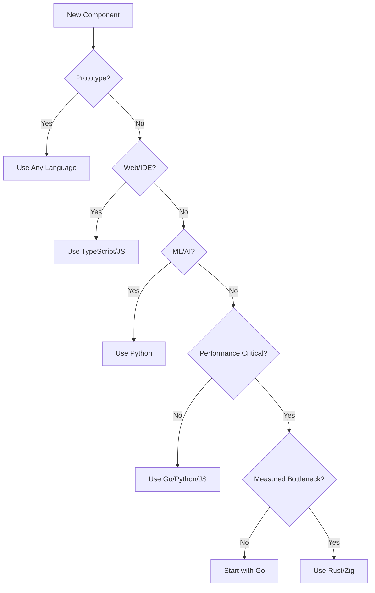

# Implementation Language Strategy

## Philosophy: Right Tool for the Right Job

We embrace a **polyglot approach** - using the best language for each component rather than forcing everything into one language. This maximizes both contributor accessibility and production performance.

## Core Principles

1. **Start with what you know** - Prototypes in any language are welcome
2. **Optimize where proven necessary** - Performance bottlenecks get optimized
3. **Support transitions** - We help migrate critical code when needed
4. **Preserve ecosystems** - Use language strengths (Python for ML, JS for web)
5. **Measure, don't assume** - Performance requirements backed by benchmarks

## Language Recommendations by Component

### 🟢 Use Any Language (Performance Not Critical)

These components can remain in whatever language is most convenient:

| Component | Recommended | Why |
|-----------|-------------|-----|
| **Prototypes** | Any | Speed of development matters most |
| **IDE Extensions** | TypeScript/JS | Native IDE language |
| **Web Interfaces** | TypeScript/React | Web ecosystem |
| **CLI Tools** | Python/Go/Node | Developer convenience |
| **Documentation** | Markdown/Python | Ecosystem tools |
| **Test Suites** | Same as component | Testing familiarity |
| **Configuration** | YAML/JSON/TOML | Standard formats |

### 🟡 Performance-Aware (Optimize if Needed)

These might need optimization based on benchmarks:

| Component | Start With | Optimize To | Trigger |
|-----------|-----------|------------|---------|
| **Pattern Matching** | Python/JS | Rust/Go | >100ms latency |
| **AST Parsing** | Tree-sitter JS | Rust binding | >1000 files |
| **Fingerprinting** | Any | Rust/Zig | >50ms per file |
| **Database Queries** | ORM | Raw SQL | >500ms query |
| **API Servers** | Node/Python | Go/Rust | >10k req/sec |

### 🔴 Performance-Critical (Plan for Optimization)

These components will likely need high-performance implementations:

| Component | Initial | Production | Benchmark Target |
|-----------|---------|------------|------------------|
| **Semantic Engine** | Python | Rust | <10ms per function |
| **Pattern Index** | Any | Rust/C++ | <1ms lookup |
| **Stream Processing** | Any | Rust/Go | 100k patterns/sec |
| **Memory Cache** | Any | Rust | <100μs access |

## Performance Benchmarks

### Current Reality (Prototype Stage)

```python
# Python prototype performance
parse_file: 150ms average
generate_fingerprint: 80ms average  
match_pattern: 200ms average
total_latency: 430ms per file

# This is fine for Phase 1 (local, <1000 files)
```

### Production Requirements

```rust
// Rust production targets
parse_file: 15ms average (-90%)
generate_fingerprint: 5ms average (-94%)
match_pattern: 2ms average (-99%)
total_latency: 22ms per file (-95%)

// Required for Phase 3 (enterprise, >100k files)
```

### When to Optimize

| Metric | Acceptable | Consider Optimizing | Must Optimize |
|--------|------------|-------------------|---------------|
| Response time | <200ms | 200-500ms | >500ms |
| Memory usage | <500MB | 500MB-2GB | >2GB |
| CPU usage | <25% | 25-50% | >50% sustained |
| File processing | <100ms | 100-500ms | >500ms |

## Migration Paths

### Python → Rust (Gradual via PyO3)

```python
# Start: Pure Python
def calculate_fingerprint(ast):
    return complex_calculation(ast)

# Step 1: Move hot path to Rust
import fingerprint_rust  # PyO3 module
def calculate_fingerprint(ast):
    return fingerprint_rust.calculate(ast)

# Step 2: Benchmark and iterate
# Only migrate more if benchmarks show need
```

### JavaScript → Rust (Via WASM)

```javascript
// Start: Pure JavaScript
function matchPattern(pattern, fingerprint) {
    return complexMatching(pattern, fingerprint);
}

// Step 1: WASM module for hot path
import init, { match_pattern } from './matcher_wasm';
await init();
function matchPattern(pattern, fingerprint) {
    return match_pattern(pattern, fingerprint);
}

// JavaScript wrapper remains, Rust does heavy lifting
```

### Go → Rust (Selective CGO)

```go
// Start: Pure Go
func ProcessPatterns(patterns []Pattern) Results {
    return slowProcessing(patterns)
}

// Step 1: CGO for critical section
// #cgo LDFLAGS: -L. -lpattern_matcher
// #include "pattern_matcher.h"
import "C"

func ProcessPatterns(patterns []Pattern) Results {
    return C.process_patterns_rust(patterns)
}
```

## Language Selection Decision Tree



## Support for Contributors

### If You Don't Know Rust

**That's perfectly fine!** Options:

1. **Write prototype in your language** - We'll help optimize later if needed
2. **Focus on non-performance-critical parts** - Plenty of important work
3. **Learn gradually** - We provide Rust mentorship
4. **Collaborate** - Pair with Rust developers on performance parts

### Rust Learning Resources

- **Rust Book**: https://doc.rust-lang.org/book/
- **Rust by Example**: https://doc.rust-lang.org/rust-by-example/
- **Our Templates**: `/templates/rust-component/`
- **Office Hours**: Tuesdays 2pm UTC - Rust help session
- **Buddy System**: Get paired with experienced Rustacean

### Performance Help Available

- **Profiling assistance** - We'll help identify bottlenecks
- **Migration support** - We'll help port critical paths
- **Code review** - Performance-focused reviews available
- **Benchmarking** - Automated performance regression tests

## Language-Specific Guidelines

### Python Components

```python
# Preferred for:
- Rapid prototyping
- ML/AI integration  
- Data analysis
- Scripting

# Guidelines:
- Use type hints
- Prefer dataclasses
- Use poetry for dependencies
- Profile with cProfile
```

### Rust Components

```rust
// Preferred for:
// - Performance-critical paths
// - Memory-sensitive operations
// - Concurrent processing
// - System-level integration

// Guidelines:
// - Prefer safe Rust (minimize unsafe)
// - Use cargo clippy
// - Benchmark with criterion
// - Document safety invariants
```

### Go Components

```go
// Preferred for:
// - Network services
// - Concurrent operations
// - CLI tools
// - Good-enough performance

// Guidelines:
// - Use contexts properly
// - Handle errors explicitly
// - Benchmark with testing.B
// - Keep interfaces small
```

### TypeScript/JavaScript

```typescript
// Preferred for:
// - Web interfaces
// - IDE extensions
// - Node.js tools
// - Browser components

// Guidelines:
// - Use TypeScript for new code
// - Prefer functional style
// - Use ESLint + Prettier
// - Bundle size matters
```

## FAQ

### Q: Do I need to learn Rust to contribute?
**No!** Most components don't need Rust. Focus on what you know.

### Q: Will my Python prototype be thrown away?
**No!** If it works and performs adequately, it stays. We only optimize proven bottlenecks.

### Q: Can I use [uncommon language]?
**For prototypes, yes!** For production, we prefer mainstream languages for maintainability.

### Q: How do I know if my code is fast enough?
**We provide benchmarks.** If it meets targets, language doesn't matter.

### Q: What if I want to learn Rust?
**We'll help!** Pair programming, code reviews, and mentorship available.

## Examples of Successful Mixed-Language Projects

- **Visual Studio Code**: TypeScript + C++ (performance parts)
- **TensorFlow**: Python API + C++ engine
- **Docker**: Go + C (system calls)
- **Firefox**: Rust + C++ + JavaScript
- **Discord**: Python → Rust migration for performance

## The Bottom Line

> **Write code in the language that lets you deliver value fastest. We'll help optimize the critical paths when real-world usage proves it's needed.**

Performance matters, but **shipping working code matters more**. We can always optimize later - we can't optimize code that was never written because the language barrier was too high.

## Migration Success Stories

### Example 1: Pattern Matcher
- **Started**: Python prototype (2 weeks to build)
- **Performance**: 200ms per pattern (too slow)
- **Migration**: Core loop to Rust via PyO3 (3 days)
- **Result**: 2ms per pattern (100x improvement)
- **Lesson**: 90% stayed Python, 10% Rust = massive win

### Example 2: AST Parser
- **Started**: JavaScript using babel-parser
- **Performance**: Adequate for <1000 files
- **Migration**: Not needed! Still JavaScript
- **Lesson**: Don't optimize prematurely

## Get Started

1. **Pick your language** based on comfort and component type
2. **Build something that works** 
3. **Measure performance** against targets
4. **Optimize if needed** (we'll help!)
5. **Share your experience** to help others

Remember: **The best code is code that exists and works**, regardless of language.