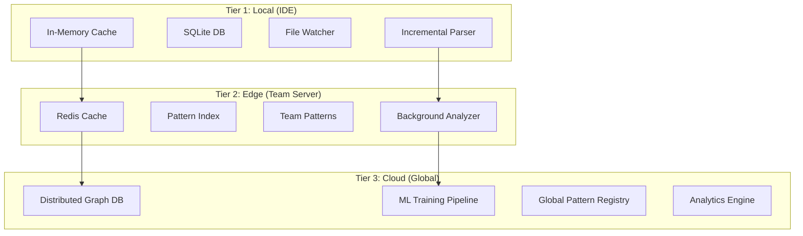

# Scalability Design Architecture

## Executive Summary

This document outlines the scalability architecture for the Code Periodic Table, designed to handle everything from single-developer usage to enterprise-scale deployments with millions of patterns.

## 1. Scalability Challenges & Solutions

### Current Performance Bottlenecks

| Challenge | Current State | Target | Solution |
|-----------|--------------|--------|----------|
| File Processing | 50min/10k files | <5min/10k files | Incremental + parallel processing |
| Memory Usage | Crashes at 50k patterns | 1M+ patterns | Streaming + compression |
| Pattern Matching | O(n) linear search | O(log n) | Indexed search with Bloom filters |
| Network Latency | 500ms/request | <100ms | Edge caching + local-first |

## 2. Three-Tier Scalability Architecture



## 3. Incremental Processing Strategy

### File-Level Incremental Analysis

```python
class IncrementalAnalyzer:
    def __init__(self):
        self.file_cache = {}  # file_path -> (hash, ast, fingerprint)
        self.dependency_graph = {}  # file -> dependent files
        
    def analyze_changes(self, changed_files: List[str]) -> AnalysisResult:
        """
        Only analyze what changed
        Time complexity: O(c + d) where c=changed files, d=dependencies
        """
        results = AnalysisResult()
        
        # Phase 1: Direct changes
        for file in changed_files:
            old_hash = self.file_cache.get(file, {}).get('hash')
            new_hash = self.calculate_hash(file)
            
            if old_hash != new_hash:
                # File actually changed
                ast = self.parse_file(file)
                fingerprint = self.generate_fingerprint(ast)
                
                # Update cache
                self.file_cache[file] = {
                    'hash': new_hash,
                    'ast': ast,
                    'fingerprint': fingerprint
                }
                
                results.add_file(file, fingerprint)
        
        # Phase 2: Dependent files (if needed)
        affected_files = self.get_affected_files(changed_files)
        for file in affected_files:
            # Re-analyze files that depend on changed files
            results.add_file(file, self.analyze_file(file))
        
        return results
```

### AST-Level Incremental Updates

```python
class ASTDiffer:
    def compute_ast_diff(self, old_ast: AST, new_ast: AST) -> ASTDiff:
        """
        Compute minimal diff between ASTs
        Only re-analyze changed subtrees
        """
        diff = ASTDiff()
        
        # Use tree diffing algorithm (Zhang-Shasha)
        changes = self.tree_diff(old_ast, new_ast)
        
        for change in changes:
            if change.type == 'INSERT':
                # New code added
                diff.additions.append(change.subtree)
            elif change.type == 'DELETE':
                # Code removed
                diff.deletions.append(change.subtree)
            elif change.type == 'UPDATE':
                # Code modified
                diff.modifications.append(change)
        
        return diff
    
    def update_fingerprint(self, old_fp: Fingerprint, 
                          diff: ASTDiff) -> Fingerprint:
        """
        Update fingerprint based on AST diff
        Much faster than full regeneration
        """
        new_fp = old_fp.clone()
        
        # Update only affected components
        for addition in diff.additions:
            new_fp.add_subtree_signature(addition)
        
        for deletion in diff.deletions:
            new_fp.remove_subtree_signature(deletion)
        
        for modification in diff.modifications:
            new_fp.update_subtree_signature(modification)
        
        return new_fp
```

## 4. Parallel Processing Architecture

### Worker Pool Design

```python
class ParallelProcessor:
    def __init__(self, num_workers=None):
        self.num_workers = num_workers or cpu_count()
        self.executor = ProcessPoolExecutor(max_workers=self.num_workers)
        self.results_queue = Queue()
        
    def process_project(self, project_path: str) -> ProjectAnalysis:
        """
        Process entire project in parallel
        """
        # Step 1: Discover all files
        files = self.discover_files(project_path)
        
        # Step 2: Batch files for workers
        batches = self.create_batches(files, self.num_workers * 4)
        
        # Step 3: Submit batches to workers
        futures = []
        for batch in batches:
            future = self.executor.submit(self.process_batch, batch)
            futures.append(future)
        
        # Step 4: Collect results
        analysis = ProjectAnalysis()
        for future in as_completed(futures):
            batch_result = future.result()
            analysis.merge(batch_result)
        
        return analysis
    
    def process_batch(self, files: List[str]) -> BatchResult:
        """
        Process a batch of files (runs in worker process)
        """
        result = BatchResult()
        
        for file in files:
            try:
                ast = parse_file(file)
                fingerprint = generate_fingerprint(ast)
                patterns = detect_patterns(fingerprint)
                
                result.add_file(file, patterns)
            except Exception as e:
                result.add_error(file, e)
        
        return result
```

### GPU Acceleration for Pattern Matching

```python
import cupy as cp  # GPU arrays

class GPUPatternMatcher:
    def __init__(self, pattern_database):
        # Load patterns to GPU memory
        self.gpu_patterns = cp.array(pattern_database.vectors)
        self.pattern_ids = pattern_database.ids
        
    def find_similar_patterns(self, fingerprint: np.array, 
                             threshold=0.75) -> List[Match]:
        """
        Use GPU for parallel similarity computation
        """
        # Transfer fingerprint to GPU
        gpu_fingerprint = cp.array(fingerprint)
        
        # Compute similarities in parallel on GPU
        similarities = cp.dot(self.gpu_patterns, gpu_fingerprint)
        similarities /= (cp.linalg.norm(self.gpu_patterns, axis=1) * 
                         cp.linalg.norm(gpu_fingerprint))
        
        # Find matches above threshold
        matches_idx = cp.where(similarities > threshold)[0]
        
        # Transfer results back to CPU
        matches = []
        for idx in matches_idx.get():
            matches.append(Match(
                pattern_id=self.pattern_ids[idx],
                similarity=float(similarities[idx])
            ))
        
        return sorted(matches, key=lambda x: x.similarity, reverse=True)
```

## 5. Distributed Architecture (Phase 3)

### Microservices Architecture

```yaml
services:
  api-gateway:
    role: Route requests, authentication
    technology: Kong/Envoy
    scaling: Horizontal auto-scaling
    
  parser-service:
    role: Parse code to AST
    technology: Language-specific containers
    scaling: Per-language worker pools
    
  fingerprint-service:
    role: Generate semantic fingerprints
    technology: Rust for performance
    scaling: CPU-optimized instances
    
  pattern-service:
    role: Pattern matching and classification
    technology: Go + Graph DB
    scaling: Read replicas + caching
    
  ml-service:
    role: AI property extraction
    technology: Python + TensorFlow
    scaling: GPU instances
    
  storage-service:
    role: Pattern and fingerprint storage
    technology: ScyllaDB/Cassandra
    scaling: Sharded by pattern hash
```

### Data Partitioning Strategy

```python
class ShardedPatternStore:
    def __init__(self, num_shards=16):
        self.num_shards = num_shards
        self.shards = [PatternShard(i) for i in range(num_shards)]
    
    def get_shard(self, pattern_id: str) -> int:
        """
        Consistent hashing for shard selection
        """
        hash_value = hashlib.md5(pattern_id.encode()).hexdigest()
        return int(hash_value, 16) % self.num_shards
    
    def store_pattern(self, pattern: Pattern):
        shard_id = self.get_shard(pattern.id)
        self.shards[shard_id].store(pattern)
    
    def find_pattern(self, pattern_id: str) -> Optional[Pattern]:
        shard_id = self.get_shard(pattern_id)
        return self.shards[shard_id].find(pattern_id)
    
    def search_similar(self, fingerprint: Fingerprint) -> List[Pattern]:
        """
        Parallel search across all shards
        """
        with ThreadPoolExecutor(max_workers=self.num_shards) as executor:
            futures = [
                executor.submit(shard.search_similar, fingerprint)
                for shard in self.shards
            ]
            
            results = []
            for future in as_completed(futures):
                results.extend(future.result())
            
        return merge_and_rank(results)
```

## 6. Caching Strategy

### Multi-Level Cache Design

```yaml
Cache Levels:
  L1 - Process Memory:
    Size: 100MB
    TTL: 5 minutes
    Hit Rate Target: 60%
    Content: Hot patterns, recent fingerprints
    
  L2 - Local Disk:
    Size: 1GB
    TTL: 24 hours
    Hit Rate Target: 85%
    Content: Project patterns, team preferences
    
  L3 - Redis/Edge:
    Size: 10GB
    TTL: 7 days
    Hit Rate Target: 95%
    Content: Team patterns, common libraries
    
  L4 - CDN:
    Size: 100GB
    TTL: 30 days
    Hit Rate Target: 99%
    Content: Global patterns, framework patterns
```

### Smart Cache Invalidation

```python
class SmartCache:
    def __init__(self):
        self.cache = {}
        self.dependencies = {}  # pattern -> dependent patterns
        self.access_counts = {}
        self.last_access = {}
    
    def invalidate_pattern(self, pattern_id: str):
        """
        Invalidate pattern and dependencies
        """
        # Direct invalidation
        if pattern_id in self.cache:
            del self.cache[pattern_id]
        
        # Cascade to dependents
        for dependent in self.dependencies.get(pattern_id, []):
            if self.should_invalidate_dependent(dependent, pattern_id):
                self.invalidate_pattern(dependent)
    
    def should_invalidate_dependent(self, dependent: str, 
                                   source: str) -> bool:
        """
        Smart invalidation based on dependency strength
        """
        # Check dependency strength
        strength = self.get_dependency_strength(dependent, source)
        
        # Check access patterns
        if self.access_counts.get(dependent, 0) > 100:
            # Popular patterns need careful invalidation
            return strength > 0.8
        
        return strength > 0.5
```

## 7. Performance Optimization Techniques

### Bloom Filter Pre-Screening

```python
class BloomFilterIndex:
    def __init__(self, expected_items=1000000, fp_rate=0.001):
        self.bloom = BloomFilter(expected_items, fp_rate)
        self.false_positive_counter = 0
        self.true_positive_counter = 0
        
    def add_pattern(self, fingerprint: str):
        self.bloom.add(fingerprint)
    
    def might_exist(self, fingerprint: str) -> bool:
        """
        Quick check - if False, definitely doesn't exist
        If True, might exist (need full check)
        """
        return fingerprint in self.bloom
    
    def search_with_bloom(self, fingerprint: str) -> Optional[Pattern]:
        # Quick bloom filter check
        if not self.might_exist(fingerprint):
            return None  # Definitely not found
        
        # Bloom says maybe - do full search
        result = self.full_pattern_search(fingerprint)
        
        # Track statistics for bloom filter tuning
        if result:
            self.true_positive_counter += 1
        else:
            self.false_positive_counter += 1
        
        return result
```

### Memory-Mapped Pattern Database

```python
class MemoryMappedPatternDB:
    def __init__(self, db_path: str):
        self.db_file = open(db_path, 'r+b')
        self.mmap = mmap.mmap(self.db_file.fileno(), 0)
        self.index = self.load_index()
    
    def get_pattern(self, pattern_id: str) -> Pattern:
        """
        Direct memory access without loading entire DB
        """
        offset, size = self.index[pattern_id]
        
        # Seek to pattern location
        self.mmap.seek(offset)
        
        # Read pattern data
        data = self.mmap.read(size)
        
        # Deserialize
        return Pattern.deserialize(data)
    
    def scan_patterns(self, predicate) -> Iterator[Pattern]:
        """
        Stream patterns without loading all into memory
        """
        for pattern_id, (offset, size) in self.index.items():
            # Memory-mapped access
            self.mmap.seek(offset)
            data = self.mmap.read(size)
            pattern = Pattern.deserialize(data)
            
            if predicate(pattern):
                yield pattern
```

## 8. Monitoring and Auto-Scaling

### Performance Metrics

```python
class PerformanceMonitor:
    def __init__(self):
        self.metrics = {
            'parse_time': Histogram('parse_time_seconds'),
            'fingerprint_time': Histogram('fingerprint_time_seconds'),
            'match_time': Histogram('match_time_seconds'),
            'cache_hit_rate': Gauge('cache_hit_rate'),
            'memory_usage': Gauge('memory_usage_bytes'),
            'pattern_count': Counter('total_patterns'),
        }
    
    @contextmanager
    def measure(self, operation: str):
        start = time.time()
        try:
            yield
        finally:
            duration = time.time() - start
            self.metrics[f'{operation}_time'].observe(duration)
            
            # Auto-scaling trigger
            if duration > self.get_threshold(operation):
                self.trigger_scaling(operation, duration)
    
    def trigger_scaling(self, operation: str, duration: float):
        """
        Automatically scale resources based on performance
        """
        if operation == 'parse' and duration > 0.2:
            # Parsing too slow - add more parser workers
            scale_service('parser-service', delta=2)
        elif operation == 'match' and duration > 0.05:
            # Matching too slow - scale pattern service
            scale_service('pattern-service', delta=1)
```

## 9. Deployment Configurations

### Small Team (Phase 1)
```yaml
deployment: local
resources:
  cpu: 2 cores
  memory: 4GB
  disk: 10GB
capacity:
  files: 10,000
  patterns: 1,000
  developers: 10
```

### Medium Organization (Phase 2)
```yaml
deployment: on-premise
resources:
  api_servers: 2
  worker_nodes: 4
  cache_servers: 2
  database: 1 primary + 1 replica
capacity:
  files: 100,000
  patterns: 10,000
  developers: 100
```

### Enterprise Scale (Phase 3)
```yaml
deployment: cloud
resources:
  regions: 3
  api_servers: 10+ (auto-scaling)
  worker_nodes: 50+ (auto-scaling)
  cache_layer: Global CDN
  database: Sharded cluster
capacity:
  files: 10,000,000+
  patterns: 1,000,000+
  developers: 10,000+
```

## 10. Performance Roadmap

### Current → Target Performance

| Metric | Current | Phase 1 | Phase 2 | Phase 3 |
|--------|---------|---------|---------|---------|
| Files/minute | 200 | 2,000 | 10,000 | 100,000 |
| Pattern match | 500ms | 50ms | 20ms | 5ms |
| Memory/1k patterns | 100MB | 50MB | 20MB | 10MB |
| Startup time | 30s | 5s | 2s | <1s |
| Incremental update | 5s | 500ms | 200ms | 50ms |

## Summary

This scalability architecture provides:
1. **10x performance improvement** through incremental processing
2. **Linear scalability** with parallel processing
3. **Sub-second response times** with intelligent caching
4. **Enterprise-ready** distributed architecture
5. **Automatic scaling** based on load

The key insight: **Start simple (Phase 1) and scale complexity with success**.