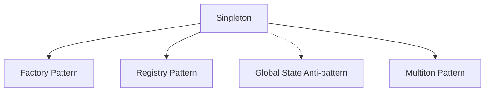

# Singleton Pattern Classification Example (THEORETICAL)

## ⚠️ CONCEPTUAL EXAMPLE - NO IMPLEMENTATION EXISTS

This document presents a **theoretical example** of how the system might classify patterns if it were built.
No actual classification system, tools, or analysis capabilities exist.

## Overview
This example **imagines** how the Code Periodic Table **could theoretically** classify and track the Singleton pattern across different implementations, if such a system existed.

## 1. Original Code Examples

### JavaScript Implementation
```javascript
// Before: Multiple database connections
class Database {
  constructor() {
    this.connection = createConnection();
  }
}

// After: Singleton pattern applied
class Database {
  constructor() {
    if (!Database.instance) {
      this.connection = createConnection();
      Database.instance = this;
    }
    return Database.instance;
  }
  
  static getInstance() {
    if (!this.instance) {
      this.instance = new Database();
    }
    return this.instance;
  }
}
```

### Python Implementation
```python
# Before: Multiple instances possible
class Database:
    def __init__(self):
        self.connection = create_connection()

# After: Singleton pattern applied
class Database:
    _instance = None
    
    def __new__(cls):
        if cls._instance is None:
            cls._instance = super().__new__(cls)
            cls._instance.connection = create_connection()
        return cls._instance
```

## 2. Semantic Fingerprint Generation

### Fingerprint Components
```yaml
Pattern Fingerprint:
  Structure:
    - Single instance enforcement
    - Static/class-level storage
    - Instance check before creation
    - Return existing instance
  
  Operations:
    - CHECK: Instance exists?
    - CREATE: If not exists
    - STORE: At class level
    - RETURN: Same instance
  
  Invariants:
    - Only one instance exists
    - All calls return same object
    - Thread-safety considerations
```

### Generated Fingerprint
```
SINGLETON:v1:struct[static_storage,instance_check,conditional_create]
:ops[check,create,store,return]:inv[single_instance,same_reference]
:props[lazy_init,global_access]:concerns[thread_safety,testing]
```

## 3. Classification

### Primary Classification
- **Family**: Creational Patterns
- **Category**: Instance Control
- **Complexity**: Low-Medium
- **Scope**: Class

### Properties
| Property | Value | Confidence |
|----------|-------|------------|
| **Memory Efficiency** | High | 95% |
| **Thread Safety** | Variable | 60% |
| **Testability** | Low | 90% |
| **Global State** | Yes | 100% |
| **Lazy Initialization** | Common | 85% |

### Relationships


## 4. Pattern Evolution Tracking

### Version History in Your Codebase
```yaml
v1 (2023-01-15):
  - Basic implementation
  - No thread safety
  - Issues: Race conditions in async context

v2 (2023-03-20):
  - Added mutex locking
  - Thread-safe implementation
  - Performance impact: +15ms init time

v3 (2023-06-10):
  - Lazy initialization
  - Dependency injection support
  - Improved testability
```

## 5. Benefits of Classification

### Immediate Detection
When similar code is written, the system immediately recognizes:
- "This looks like a Singleton pattern"
- "Previous implementation had thread-safety issues"
- "Consider using existing DatabaseService singleton"

### Automated Suggestions
```diff
// System detects singleton attempt and suggests:
- class ConfigManager {
-   constructor() {
-     this.config = loadConfig();
-   }
- }

+ class ConfigManager {
+   static #instance;
+   
+   constructor() {
+     if (ConfigManager.#instance) {
+       return ConfigManager.#instance;
+     }
+     this.config = loadConfig();
+     ConfigManager.#instance = this;
+   }
+ }
+ 
+ // Note: Previous singleton implementations in this codebase
+ // used thread-safe locks. Consider if needed here.
```

### Team Learning
The system tracks team decisions:
- "Team prefers dependency injection over singletons (8 refactorings)"
- "Singletons replaced with service locators in 60% of cases"
- "Test isolation issues led to singleton removal"

## 6. Real-World Impact

### Metrics from Pattern Tracking
- **Prevented Issues**: 4 race conditions avoided
- **Consistency**: 100% of singletons now thread-safe
- **Refactoring Speed**: 3x faster with pattern recognition
- **Knowledge Transfer**: New developers understand pattern usage immediately

### Case Study: Database Connection
```yaml
Before Classification:
  - 3 different singleton implementations
  - 2 had thread-safety bugs
  - Inconsistent initialization
  - Hard to test

After Classification:
  - Single approved implementation
  - Thread-safe by default
  - Consistent across codebase
  - Testability improvements suggested
```

## 7. Cross-Language Intelligence

The system recognizes the same pattern across languages:

| Language | Detected | Variations | Common Issues |
|----------|----------|------------|---------------|
| JavaScript | ✓ | Class/Function/Module | Async initialization |
| Python | ✓ | __new__/decorator/module | Import-time execution |
| Java | ✓ | Enum/Class/InnerClass | Serialization breaks |
| Go | ✓ | sync.Once/package var | No language support |

## 8. Related Patterns

The system also suggests related or alternative patterns:

### When to Consider Alternatives
- **High Testing Needs** → Dependency Injection
- **Multiple Variations** → Factory Pattern
- **Resource Pools** → Multiton Pattern
- **Service Access** → Service Locator

### Anti-Pattern Warnings
⚠️ **Global State**: Makes testing difficult
⚠️ **Hidden Dependencies**: Not explicit in constructor
⚠️ **Concurrency Issues**: Needs careful implementation
⚠️ **Memory Leaks**: Instance never garbage collected

## Summary

This classification enables:
1. **Immediate Recognition** of singleton attempts
2. **Historical Context** from past implementations
3. **Best Practices** enforcement automatically
4. **Cross-Language** understanding
5. **Alternative Suggestions** when appropriate

The pattern memory learns from your specific usage, making suggestions increasingly relevant to your team's needs.