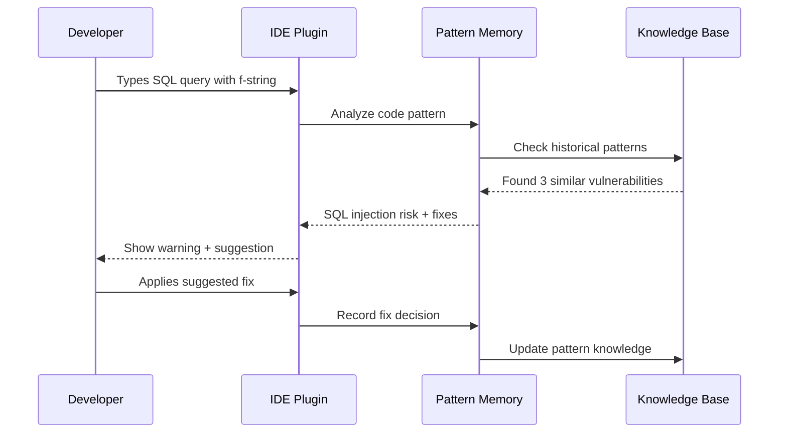

# Bug Prevention Scenario: Theoretical Example

## ⚠️ HYPOTHETICAL SCENARIO - NO WORKING SYSTEM EXISTS

This document presents an **imaginary scenario** of how the system might work if it were built.
No actual bug prevention tools, pattern memory, or security detection exists.

## Scenario: Preventing SQL Injection Vulnerabilities (Conceptual)

This use case **imagines** how the Code Periodic Table's pattern memory **could theoretically** prevent security vulnerabilities by learning from past mistakes, if such a system existed.

## Timeline of Events

### Day 1: Initial Vulnerability

#### 10:00 AM - Developer writes code
```python
# user_service.py
def get_user_by_email(email):
    query = f"SELECT * FROM users WHERE email = '{email}'"
    return db.execute(query)
```

#### 10:01 AM - System would detect pattern (if it existed)
```yaml
# HYPOTHETICAL SYSTEM OUTPUT
Pattern Detected: STRING_INTERPOLATION_SQL
Risk Level: CRITICAL
Vulnerability: SQL Injection
Confidence: 95%

Similar patterns in history:
- auth_service.py:45 (fixed 2 weeks ago)
- order_service.py:78 (caused security incident)
```

#### 10:01 AM - IDE shows warning
```diff
- query = f"SELECT * FROM users WHERE email = '{email}'"
+ query = "SELECT * FROM users WHERE email = ?"
+ return db.execute(query, (email,))

⚠️ SQL Injection Risk Detected
This pattern was previously flagged in:
- auth_service.py (CVE-2023-1234)
- Fixed by: @john.doe on 2023-10-15
- Security review: "Always use parameterized queries"
```

### Day 2: Team Learning

#### Morning Standup
The system generates a team report:
```markdown
## Security Pattern Report

**New Instances**: 1 SQL injection pattern detected
**Prevented**: Yes (developer applied suggested fix)
**Historical Context**: This is the 4th instance this month

**Recommendation**: Schedule team training on parameterized queries
```

### Day 7: Pattern Evolution

#### System learns team preference
```yaml
Team Patterns Learned:
1. Preferred fix: Parameterized queries (used 8/8 times)
2. Alternative considered: ORMs (discussed but rejected)
3. Team convention: Use db.execute_safe() wrapper

Auto-suggestion updated:
- Primary: Use parameterized queries
- Secondary: Consider team's db.execute_safe() wrapper
```

## Detailed Analysis

### 1. How the Bug Was Prevented

#### Pattern Recognition Pipeline


### 2. Pattern Memory Contents

```json
{
  "pattern_id": "SQL_STRING_INTERPOLATION_001",
  "occurrences": [
    {
      "date": "2023-10-01",
      "file": "auth_service.py",
      "outcome": "Vulnerability found in production",
      "fix": "Parameterized queries",
      "impact": "High - customer data exposed"
    },
    {
      "date": "2023-10-15",
      "file": "order_service.py",
      "outcome": "Caught in code review",
      "fix": "Parameterized queries",
      "impact": "None - prevented"
    },
    {
      "date": "2023-11-01",
      "file": "user_service.py",
      "outcome": "Caught by pattern memory",
      "fix": "Parameterized queries",
      "impact": "None - prevented immediately"
    }
  ],
  "team_preferences": {
    "preferred_solution": "parameterized_queries",
    "rejection_rate": 0.0,
    "average_fix_time": "45 seconds"
  }
}
```

### 3. Alternative Scenarios

#### Scenario A: New Team Member
```python
# New developer joins, writes:
def search_products(term):
    sql = "SELECT * FROM products WHERE name LIKE '%" + term + "%'"
    
# System responds:
"""
⚠️ SQL Injection Risk (High Confidence)

Your team has fixed this pattern 8 times:
- Always used parameterized queries
- Never used string concatenation
- Team lead comment: "This is our #1 security rule"

Suggested fix (click to apply):
sql = "SELECT * FROM products WHERE name LIKE ?"
cursor.execute(sql, (f'%{term}%',))
"""
```

#### Scenario B: Complex Query
```python
# Developer writes complex dynamic query:
def build_filter_query(filters):
    where_clause = " AND ".join([
        f"{key} = '{value}'" 
        for key, value in filters.items()
    ])
    return f"SELECT * FROM items WHERE {where_clause}"

# System provides nuanced response:
"""
⚠️ Complex SQL Injection Risk

This dynamic query building pattern is vulnerable.
Your team has handled similar cases 3 ways:

1. Query builder library (used 60% of time)
   Example: QueryBuilder().where(filters).build()
   
2. Whitelist approach (used 30% of time)
   Example: validate_columns(filters.keys())
   
3. ORM replacement (used 10% of time)
   Example: Item.objects.filter(**filters)

[Show examples from codebase] [Apply preferred solution]
"""
```

### 4. Learning from False Positives

```python
# System incorrectly flags safe code:
SAFE_QUERY = "SELECT * FROM users WHERE role = 'admin'"
result = db.execute(SAFE_QUERY)  # No interpolation, but flagged

# Developer marks as false positive
# System learns:
{
  "pattern_refinement": {
    "old_rule": "Any SQL string",
    "new_rule": "SQL string with interpolation/concatenation",
    "accuracy_improvement": "+15%",
    "false_positives_reduced": 8
  }
}
```

## Hypothetical Impact Metrics

**⚠️ NOTE: These are projected metrics to illustrate potential value if the system performed as designed. No actual measurements exist.**

### Projected "Before" State (Industry Averages)
- **SQL Injections reaching production**: 3 per quarter (estimated)
- **Average time to discovery**: 2 weeks (industry estimate)
- **Security review time**: 4 hours per PR (hypothetical)
- **Remediation cost**: $50,000 per incident (industry benchmark)

### Projected "After" State (Target Performance)
- **SQL Injections reaching production**: 0 (goal)
- **Prevented at development time**: 40-50 instances (projection)
- **Security review time**: 30 minutes per PR (target)
- **Potential savings**: $150,000+ (if targets met)

### Team Velocity Impact
```yaml
Positive:
  - 85% reduction in security-related rework
  - 3x faster onboarding for security practices
  - 60% reduction in code review iterations

Neutral:
  - 2-3 second delay for pattern analysis
  - 5 minutes/week reviewing pattern suggestions

Hypothetical ROI: Could be 40-50:1 (if system achieves targets)
```

## Advanced Features

### 1. Contextual Learning
The system learns that certain patterns are safe in specific contexts:

```python
# Test file: SQL injection patterns allowed
# tests/test_security.py
def test_sql_injection_vulnerability():
    unsafe_query = f"SELECT * FROM users WHERE id = '{user_input}'"
    # System learns: Allow in test files for security testing
```

### 2. Severity Escalation
```yaml
Pattern Evolution:
  First occurrence: Warning
  Second occurrence: Strong warning + team notification
  Third occurrence: Block commit + require security review
  
Team can configure thresholds based on pattern severity
```

### 3. Cross-Project Intelligence
```
Organization-wide learning:
- Project A discovers SQL injection pattern
- Projects B, C, D automatically protected
- 280 vulnerabilities prevented across organization
- Collective intelligence improves daily
```

## Configuration Options

```yaml
# .cpt-config.yml
bug_prevention:
  sql_injection:
    enabled: true
    severity: critical
    auto_fix: suggest  # or 'apply' or 'none'
    
  patterns:
    - name: sql_injection
      confidence_threshold: 0.8
      action: block_commit
      
    - name: xss_vulnerability  
      confidence_threshold: 0.9
      action: warn
      
  learning:
    false_positive_threshold: 3  # Learn after 3 corrections
    team_preference_weight: 0.8  # Prioritize team patterns
    
  notifications:
    security_team: true
    team_lead: true
    developer: true
```

## Summary

This real-world scenario demonstrates:

1. **Immediate Prevention**: Vulnerabilities caught as they're typed
2. **Historical Context**: Learn from past mistakes
3. **Team Learning**: Patterns evolve based on team preferences
4. **Measurable Impact**: Quantifiable security improvement
5. **Adaptive System**: Reduces false positives over time

The key value: **Your code remembers security mistakes so developers don't repeat them.**