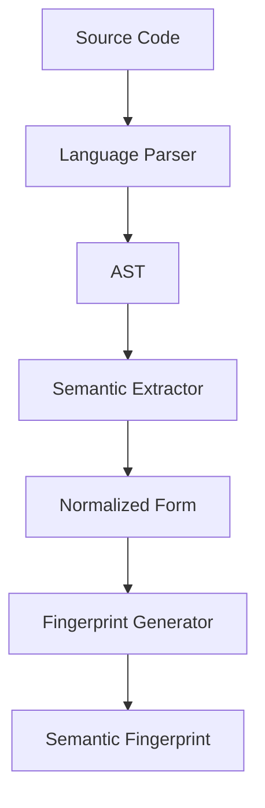

# Cross-Language Semantic Fingerprint Comparison

## Overview
This document demonstrates how semantic fingerprinting identifies the same pattern across different programming languages, despite syntactic differences.

## Example: Array Filtering Pattern

### 1. Original Implementations

#### JavaScript
```javascript
// Filter users over 18 and active
const adults = users.filter(user => 
  user.age >= 18 && user.isActive
);
```

#### Python
```python
# Filter users over 18 and active
adults = [user for user in users 
          if user.age >= 18 and user.is_active]
```

#### Java
```java
// Filter users over 18 and active
List<User> adults = users.stream()
    .filter(user -> user.getAge() >= 18 && user.isActive())
    .collect(Collectors.toList());
```

#### Go
```go
// Filter users over 18 and active
var adults []User
for _, user := range users {
    if user.Age >= 18 && user.IsActive {
        adults = append(adults, user)
    }
}
```

### 2. Semantic Fingerprint Extraction

Despite different syntax, all examples share the same semantic structure:

```yaml
Semantic Components:
  Input: Collection[T]
  Operation: Filter
  Condition: Compound(age_check AND status_check)
  Output: Collection[T] (subset)
  
Abstract Syntax:
  FILTER(
    SOURCE: collection,
    PREDICATE: AND(
      COMPARE(field:age, op:>=, value:18),
      CHECK(field:isActive, value:true)
    ),
    RESULT: new_collection
  )
```

### 3. Generated Fingerprint

All four implementations produce the same semantic fingerprint:

```
PATTERN:filter:v1
TYPE:collection_transformation
OPERATION:filter[compound_predicate]
INPUT:collection<user>
PREDICATE:and[gte(age,18),equals(active,true)]
OUTPUT:collection<user>
COMPLEXITY:O(n)
PROPERTIES:[immutable,functional,declarative]
```

### 4. How Fingerprinting Works

#### Step 1: AST Parsing
Each language's code is parsed into an Abstract Syntax Tree:



#### Step 2: Semantic Normalization

| Language Feature | Normalized Form |
|-----------------|-----------------|
| `filter()`, list comprehension, `stream().filter()`, for-loop | `FILTER` operation |
| `=>`, `lambda`, anonymous function | `PREDICATE` |
| `&&`, `and`, logical AND | `AND` operator |
| `>=`, `.getAge() >=` | `GTE` comparison |

#### Step 3: Pattern Properties Extraction

```json
{
  "pattern_type": "collection_transformation",
  "operations": ["filter"],
  "data_flow": "collection -> subset",
  "side_effects": false,
  "complexity": "linear",
  "functional_style": true,
  "preserves_order": true
}
```

## 5. Advanced Example: Map-Reduce Pattern

### Different Implementations, Same Fingerprint

#### JavaScript (Functional)
```javascript
const total = orders
  .map(order => order.items)
  .flat()
  .filter(item => item.category === 'electronics')
  .reduce((sum, item) => sum + item.price, 0);
```

#### Python (Comprehension)
```python
total = sum(
    item.price
    for order in orders
    for item in order.items
    if item.category == 'electronics'
)
```

#### SQL (Declarative)
```sql
SELECT SUM(price) as total
FROM orders o
JOIN order_items i ON o.id = i.order_id
WHERE i.category = 'electronics';
```

#### Semantic Fingerprint (All Three)
```
PATTERN:map_reduce:v1
TYPE:aggregation
PIPELINE:[
  EXPAND:orders->items,
  FILTER:category_equals('electronics'),
  MAP:extract(price),
  REDUCE:sum
]
COMPLEXITY:O(n*m)
PROPERTIES:[aggregation,filtering,transformation]
```

## 6. Pattern Recognition Across Paradigms

### Imperative vs Functional vs Declarative

The system recognizes these as the same pattern:

#### Imperative (C++)
```cpp
int sum = 0;
for (int i = 0; i < n; i++) {
    sum += arr[i];
}
```

#### Functional (Haskell)
```haskell
sum = foldl (+) 0 arr
```

#### Declarative (SQL)
```sql
SELECT SUM(value) FROM array_table;
```

#### Unified Fingerprint
```
PATTERN:reduction:v1
TYPE:aggregation
OPERATION:fold
OPERATOR:addition
INITIAL:0
INPUT:collection<number>
OUTPUT:number
PROPERTIES:[associative,commutative]
```

## 7. Benefits of Cross-Language Fingerprinting

### 1. Knowledge Transfer
- Developer knows pattern in Python → System suggests JavaScript equivalent
- Team migrating from Java → Patterns automatically translated

### 2. Code Review Intelligence
```yaml
Review Comment Generated:
"This imperative loop in Go could be expressed as a filter
operation, similar to the JavaScript implementation in 
services/user.js:45. Both achieve the same result."
```

### 3. Refactoring Suggestions
When refactoring from imperative to functional style:
```diff
- var results = [];
- for (var i = 0; i < items.length; i++) {
-   if (items[i].price > 100) {
-     results.push(items[i]);
-   }
- }

+ const results = items.filter(item => item.price > 100);

Note: Same pattern as Python implementation in filters.py:23
```

### 4. Performance Insights
The system can warn about performance differences:
```
⚠️ Performance Note:
- JavaScript filter(): O(n) time, O(n) space
- Python comprehension: O(n) time, O(n) space  
- Java stream: O(n) time, lazy evaluation possible
- Go loop: O(n) time, incremental memory allocation

Recommendation: For large datasets (>10k items), 
consider streaming approach like Java or chunked processing.
```

## 8. Limitations and Edge Cases

### When Fingerprints Differ

Sometimes syntactically similar code has different semantics:

#### Example: Shallow vs Deep Copy
```javascript
// Shallow copy - FINGERPRINT: shallow_clone
const copy1 = [...array];

// Deep copy - FINGERPRINT: deep_clone
const copy2 = JSON.parse(JSON.stringify(array));
```

### Language-Specific Patterns

Some patterns don't translate:

| Pattern | Languages | Why Unique |
|---------|-----------|------------|
| Goroutines | Go | Concurrency model |
| List comprehensions | Python | Syntax sugar |
| LINQ | C# | Integrated queries |
| Monads | Haskell | Type system |

## 9. Fingerprint Matching Algorithm

```python
def match_fingerprints(fp1, fp2):
    """
    Compare semantic fingerprints across languages
    Returns similarity score 0-1
    """
    score = 0.0
    
    # Exact match on operation type
    if fp1.operation == fp2.operation:
        score += 0.4
    
    # Similar data flow
    if fp1.input_type == fp2.input_type and \
       fp1.output_type == fp2.output_type:
        score += 0.3
    
    # Compatible properties
    common_props = fp1.properties & fp2.properties
    score += 0.3 * (len(common_props) / 
                    max(len(fp1.properties), len(fp2.properties)))
    
    return score

# Threshold for "same pattern"
MATCH_THRESHOLD = 0.75
```

## 10. Real-World Applications

### Migration Assistant
When migrating from Python to Go:
```
Found 47 patterns in Python codebase:
- 32 have direct Go equivalents (100% match)
- 12 have similar Go patterns (>75% match)
- 3 require architectural changes

Automated translation available for 44/47 patterns.
```

### Code Review Enhancement
```
PR Comment: "This Java stream pattern matches the Python
comprehension in auth/validators.py. Consider using the
same validation logic for consistency."
```

### Learning Accelerator
```
You wrote: orders.filter(o => o.status === 'pending')

Similar patterns in codebase:
- Python: [o for o in orders if o.status == 'pending']
- SQL: SELECT * FROM orders WHERE status = 'pending'
- Ruby: orders.select { |o| o.status == 'pending' }
```

## Summary

Semantic fingerprinting enables:
1. **Language-agnostic pattern recognition**
2. **Automatic knowledge transfer between languages**
3. **Consistent patterns across polyglot codebases**
4. **Accelerated learning when switching languages**
5. **Migration and modernization assistance**

The key insight: **Patterns transcend syntax** - the same solution can be expressed in many languages, and semantic fingerprinting captures the essence regardless of implementation details.