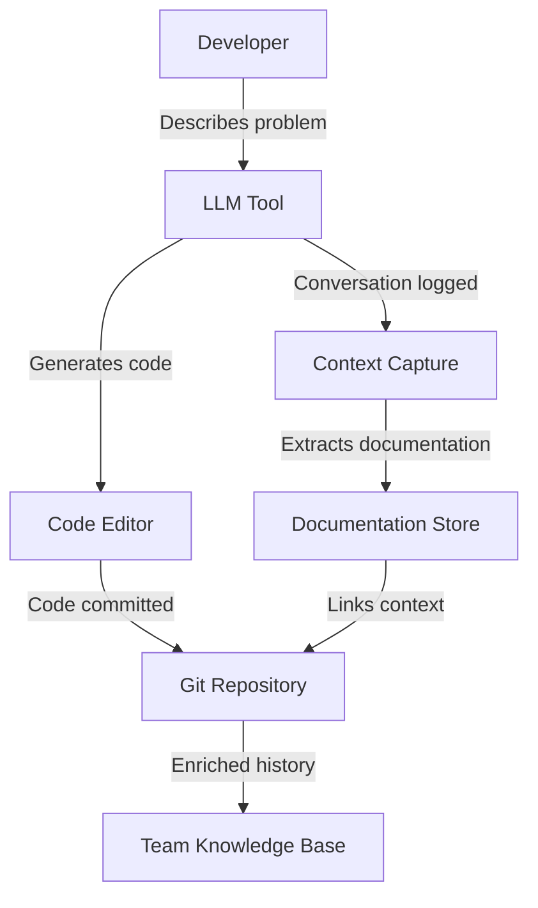

# LLM-Assisted Development Integration

## The Paradigm Shift

When developers use LLMs like Claude Code, GitHub Copilot, or ChatGPT to write code, the documentation problem fundamentally changes:

**Traditional Development**: Intent exists in developer's mind → Code is written → Documentation extracted later
**LLM-Assisted Development**: Intent explicitly stated → Discussion documented → Code generated WITH context

## Core Insight

The conversation between developer and LLM contains:
- The complete problem statement
- All design decisions and trade-offs
- Implementation reasoning
- Error corrections and refinements
- Testing considerations

This is the richest source of documentation ever available - we just need to capture and link it.

## Integration Architecture

### 1. Context Capture Layer

```python
class LLMContextCapture:
    """Captures and processes LLM coding sessions"""
    
    def __init__(self):
        self.supported_tools = [
            'claude_code',
            'github_copilot_chat',
            'chatgpt_code_interpreter',
            'cursor_ai',
            'codeium'
        ]
    
    def capture_session(self, session_data):
        """Extract documentation from LLM session"""
        return {
            'session_id': self.generate_session_id(),
            'timestamp': datetime.now(),
            'tool': session_data.tool_name,
            'conversation': self.parse_conversation(session_data),
            'code_blocks': self.extract_code_blocks(session_data),
            'decisions': self.extract_decisions(session_data),
            'context_links': self.create_context_links(session_data)
        }
    
    def parse_conversation(self, session_data):
        """Parse the developer-LLM conversation"""
        return {
            'initial_request': self.extract_user_intent(session_data),
            'requirements': self.extract_requirements(session_data),
            'constraints': self.extract_constraints(session_data),
            'llm_approach': self.extract_llm_reasoning(session_data),
            'iterations': self.extract_refinements(session_data)
        }
```

### 2. Documentation Extraction

```python
class DocumentationExtractor:
    """Extracts structured documentation from LLM conversations"""
    
    def extract_documentation(self, conversation):
        """Convert conversation to documentation"""
        
        doc = {
            'summary': self.generate_summary(conversation),
            'purpose': self.extract_why(conversation),
            'approach': self.extract_how(conversation),
            'decisions': self.extract_decision_points(conversation),
            'alternatives': self.extract_alternatives_discussed(conversation),
            'caveats': self.extract_warnings_and_limitations(conversation)
        }
        
        return self.enhance_with_ai(doc, conversation)
    
    def extract_why(self, conversation):
        """Extract the 'why' from initial problem statement"""
        patterns = [
            r"I need to (.*?) because (.*)",
            r"The problem is (.*)",
            r"We want to (.*?) in order to (.*)",
            r"Fix (.*?) that is causing (.*)"
        ]
        
        for message in conversation['messages']:
            if message['role'] == 'user':
                for pattern in patterns:
                    match = re.search(pattern, message['content'])
                    if match:
                        return self.clean_and_structure(match.groups())
        
        return self.infer_from_context(conversation)
    
    def extract_decision_points(self, conversation):
        """Extract key decisions made during development"""
        decisions = []
        
        decision_markers = [
            "should we",
            "better to",
            "I chose",
            "let's go with",
            "instead of",
            "rather than"
        ]
        
        for exchange in conversation['exchanges']:
            if any(marker in exchange.lower() for marker in decision_markers):
                decisions.append({
                    'context': exchange,
                    'decision': self.extract_decision(exchange),
                    'rationale': self.extract_rationale(exchange)
                })
        
        return decisions
```

### 3. Code-Context Linking

```typescript
interface CodeContextLink {
  codeBlock: {
    file: string;
    startLine: number;
    endLine: number;
    fingerprint: string;
  };
  
  context: {
    conversationId: string;
    messageIndex: number;
    relevantExchange: string;
    extractedMeaning: string;
  };
  
  metadata: {
    generatedBy: 'claude' | 'copilot' | 'human';
    confidence: number;
    timestamp: Date;
  };
}

class ContextLinker {
  linkCodeToConversation(code: CodeBlock, conversation: Conversation): CodeContextLink {
    // Find the conversation segment that generated this code
    const segment = this.findGeneratingSegment(code, conversation);
    
    // Extract the context around that segment
    const context = this.extractSurroundingContext(segment);
    
    // Create a permanent link
    return {
      codeBlock: this.fingerprint(code),
      context: this.summarize(context),
      metadata: this.generateMetadata(code, conversation)
    };
  }
}
```

### 4. Integration Points

#### Claude Code Integration

```bash
# Claude Code with automatic context capture
claude-code --enable-context-capture

# The system automatically:
# 1. Captures all conversations
# 2. Links generated code to prompts
# 3. Extracts documentation
# 4. Adds to git commits
```

#### Git Integration

```bash
# Commit with LLM context
git commit -m "Add authentication" \
  --llm-context=.claude-session-12345.json

# The commit includes:
# - Traditional commit message
# - Link to full LLM conversation
# - Extracted documentation
# - Decision rationale
```

#### IDE Integration

```typescript
// VS Code Extension
class LLMContextExtension {
  activate() {
    // Monitor LLM tool usage
    vscode.workspace.onDidUseAIAssistant((session) => {
      this.captureContext(session);
    });
    
    // Show context in hover
    vscode.languages.registerHoverProvider('*', {
      provideHover(document, position) {
        const context = this.findLLMContext(document, position);
        if (context) {
          return new vscode.Hover(`
            **Generated by**: ${context.tool}
            **Original request**: ${context.request}
            **Reasoning**: ${context.reasoning}
            [View full conversation](${context.link})
          `);
        }
      }
    });
  }
}
```

## Data Flow



## Privacy and Security

### Local Processing
- All context extraction happens locally
- No proprietary code sent to external services
- Conversations stored in team's infrastructure

### Selective Sharing
```python
class PrivacyFilter:
    def sanitize_for_sharing(self, context):
        """Remove sensitive information before sharing"""
        return {
            'pattern': self.extract_pattern(context),
            'decision_type': self.classify_decision(context),
            'tool_used': context.tool,
            # Exclude: actual code, variable names, business logic
        }
```

## Benefits

### 1. Zero-Friction Documentation
- No interruptions to developer flow
- Documentation extracted automatically
- Context preserved permanently

### 2. Complete Traceability
```python
# Every line of code can be traced back to:
{
    'why': "User needed to prevent race conditions",
    'how': "LLM suggested mutex pattern",
    'alternatives': ["Semaphore considered but too complex"],
    'discussion': "link://conversation/12345#message-8"
}
```

### 3. Learning and Improvement
- Understand what problems developers face
- Learn how they describe issues to LLMs
- Improve future code generation

### 4. Code Review Enhancement
```markdown
// During code review
Reviewer: "Why use recursion here?"
System: "Auto-response: Developer discussed with Claude that iteration would require 
         maintaining complex state, while recursion maps naturally to the tree structure.
         [See full discussion](link)"
```

## Implementation Phases

### Phase 1: Claude Code Prototype (Weeks 1-2)
- Basic conversation capture
- Simple context extraction
- Proof of concept

### Phase 2: Multi-Tool Support (Weeks 3-4)
- GitHub Copilot integration
- ChatGPT support
- Standardized format

### Phase 3: Intelligence Layer (Weeks 5-6)
- Smart extraction
- Pattern learning
- Automatic summarization

### Phase 4: Team Features (Weeks 7-8)
- Shared knowledge base
- Cross-developer learning
- Analytics dashboard

## Success Metrics

| Metric | Target | Measurement |
|--------|--------|-------------|
| Context capture rate | 95% of LLM sessions | Telemetry |
| Documentation quality | 80% useful rating | Developer surveys |
| Code review time | -30% reduction | PR metrics |
| Knowledge retention | 90% of decisions captured | Audit sampling |

## Example: Real Session Documentation

### Developer Prompt:
```
"I need to add rate limiting to our API endpoints to prevent abuse. 
We're seeing some IPs making 1000+ requests per minute."
```

### LLM Response + Discussion:
```
"I'll implement token bucket rate limiting... [code]... 
Alternative: Fixed window is simpler but has burst issues..."
```

### Extracted Documentation:
```json
{
  "purpose": "Prevent API abuse from high-volume IPs",
  "problem": "Some IPs making 1000+ requests/minute",
  "solution": "Token bucket rate limiting",
  "why_not_alternatives": {
    "fixed_window": "Has burst issues at window boundaries",
    "sliding_window": "Higher memory overhead"
  },
  "implementation_notes": "Tokens refresh at 10/second, bucket size 100",
  "testing_approach": "Simulate burst traffic patterns"
}
```

### Result in Codebase:
```python
# [Auto-documented by Adaptive Documentation v2]
# Purpose: Prevent API abuse (1000+ req/min from single IPs)
# Approach: Token bucket chosen over fixed-window (burst issues)
# Discussion: llm://sessions/2024-01-15/rate-limiting#decision
@rate_limit(tokens_per_second=10, bucket_size=100)
def api_endpoint():
    ...
```

## The Future

As LLM-assisted development becomes the norm, the Adaptive Documentation System evolves from:
- **Asking** developers to document
- To **extracting** documentation from their AI conversations
- To **learning** from the collective intelligence of human-AI collaboration

This isn't just about better documentation - it's about capturing the entire thought process of software development for the first time in history.

---

*"The conversation IS the documentation."*