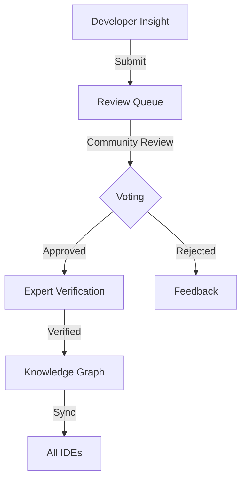

# Unified System Architecture: Classification Framework + Real-Time Intelligence

*How pattern classification and collaborative knowledge work together to deliver value*

---

## Executive Summary

The Code Periodic Table project consists of two complementary systems:
1. **A foundational classification framework** based on digital universe principles
2. **A real-time delivery system** that brings intelligence to developers as they code

This document describes how these systems work together to create a living, evolving knowledge platform for software development.

---

## 1. The Complete System Vision

### 1.1 Three Pillars of the System

```
┌─────────────────────────────────────────────────────────────────┐
│                    UNIFIED SYSTEM ARCHITECTURE                   │
├─────────────────────────────────────────────────────────────────┤
│                                                                  │
│   FOUNDATION                ENRICHMENT            DELIVERY       │
│   ┌──────────┐            ┌──────────┐         ┌──────────┐   │
│   │ Pattern  │  ────────▶ │Community │ ──────▶ │Real-time │   │
│   │Classification│         │Knowledge │         │   IDE    │   │
│   └──────────┘            └──────────┘         └──────────┘   │
│                                                                  │
│   Digital Universe         Collective           Developer        │
│   Theory                   Intelligence         Experience       │
│                                                                  │
└─────────────────────────────────────────────────────────────────┘
```

### 1.2 How They Work Together

1. **Classification provides structure** - Organizes patterns systematically
2. **Community adds knowledge** - Properties, insights, examples
3. **IDE delivers value** - Real-time information as you type
4. **Feedback improves system** - Usage data refines classification

---

## 2. System Components

### 2.1 Layer Architecture

```yaml
Presentation Layer:
  - IDE extensions (VS Code, IntelliJ, etc.)
  - Web interface for contributions
  - API for third-party tools
  
Application Layer:
  - Pattern recognition engine
  - Property extraction service
  - Contribution management
  - Voting and verification
  
Domain Layer:
  - Pattern classification logic
  - Digital universe model
  - Knowledge graph operations
  - Community intelligence
  
Infrastructure Layer:
  - Distributed storage
  - Caching systems
  - Message queues
  - Analytics pipeline
```

### 2.2 Data Flow Architecture

```
Developer Code → Local Analysis → Pattern Recognition
                      ↓
                Pattern Database ← Community Contributions
                      ↓
                Knowledge Graph ← AI Enrichment
                      ↓
                IDE Display ← Real-time Sync
```

---

## 3. Classification Foundation

### 3.1 Digital Universe Model Integration

Based on our digital universe theory:

```python
class DigitalUniverseClassifier:
    def __init__(self):
        self.fundamental_ops = [
            'sequential_execution',
            'parallel_processing', 
            'state_management',
            'io_operations'
        ]
        
        self.emergence_levels = [
            'bits',           # Level 0
            'instructions',   # Level 1
            'functions',      # Level 2
            'patterns',       # Level 3
            'systems',        # Level 4
            'intelligence'    # Level 5
        ]
        
    def classify_pattern(self, code):
        # Identify fundamental operations
        ops = self.identify_operations(code)
        
        # Determine emergence level
        level = self.determine_level(code)
        
        # Apply conservation laws
        complexity = self.measure_complexity(code)
        
        return PatternClassification(
            operations=ops,
            level=level,
            complexity=complexity
        )
```

### 3.2 Pattern Taxonomy Structure

```yaml
Pattern Hierarchy:
  Family:
    - Data Patterns
    - Control Patterns
    - Structural Patterns
    - Behavioral Patterns
    - Security Patterns
    
  Properties:
    - Semantic (what it does)
    - Performance (how fast)
    - Security (how safe)
    - Reliability (how robust)
    
  Evolution:
    - Emerging
    - Established
    - Mature
    - Legacy
    - Deprecated
```

---

## 4. Community Knowledge Layer

### 4.1 Knowledge Graph Structure

```graphql
type Pattern {
  id: ID!
  fingerprint: String!
  classification: Classification!
  properties: [Property!]!
  relationships: [Relationship!]!
  examples: [Example!]!
  contributions: [Contribution!]!
}

type Property {
  id: ID!
  type: PropertyType!
  description: String!
  confidence: Float!
  votes: Int!
  contributors: [User!]!
  evidence: [Evidence!]!
}

type Contribution {
  id: ID!
  author: User!
  type: ContributionType!
  content: String!
  status: VerificationStatus!
  votes: Votes!
  timestamp: DateTime!
}
```

### 4.2 Contribution Pipeline



### 4.3 Quality Assurance

```python
class QualityAssurance:
    def __init__(self):
        self.validators = [
            DuplicateChecker(),
            SpamDetector(),
            AccuracyVerifier(),
            ConsistencyChecker()
        ]
        
        self.thresholds = {
            'min_votes': 5,
            'approval_ratio': 0.7,
            'expert_required': True
        }
    
    def validate_contribution(self, contribution):
        # Automatic validation
        for validator in self.validators:
            if not validator.check(contribution):
                return ValidationResult(
                    approved=False,
                    reason=validator.reason
                )
        
        # Community validation
        if contribution.votes.ratio < self.thresholds['approval_ratio']:
            return ValidationResult(
                approved=False,
                reason='Insufficient community support'
            )
            
        # Expert validation for critical properties
        if contribution.is_critical and not contribution.has_expert_approval:
            return ValidationResult(
                approved=False,
                reason='Expert verification required'
            )
            
        return ValidationResult(approved=True)
```

---

## 5. Real-Time Delivery System

### 5.1 Performance Architecture

```yaml
Local Analysis (IDE):
  - Scope: Current function/class
  - Method: Incremental parsing
  - Cache: SQLite database
  - Target: <50ms response
  
Edge Processing:
  - Scope: Project-level patterns
  - Method: Background analysis
  - Cache: Redis cluster
  - Target: <200ms sync
  
Cloud Intelligence:
  - Scope: Global patterns
  - Method: Batch processing
  - Storage: Graph database
  - Target: Continuous learning
```

### 5.2 IDE Integration Strategy

```typescript
class IDEIntegration {
  private localCache: PatternCache;
  private analyzer: IncrementalAnalyzer;
  private ui: UIProvider;
  
  async onTextChange(change: TextChange) {
    // Step 1: Quick local analysis (25ms)
    const patterns = await this.analyzer.analyze(change);
    
    // Step 2: Retrieve cached properties (10ms)
    const properties = await this.localCache.get(patterns);
    
    // Step 3: Update UI immediately (15ms)
    this.ui.showProperties(properties);
    
    // Step 4: Background enrichment (async)
    this.enrichInBackground(patterns);
  }
  
  private async enrichInBackground(patterns: Pattern[]) {
    // Fetch community knowledge
    const enriched = await this.fetchCommunityKnowledge(patterns);
    
    // Update cache
    await this.localCache.update(enriched);
    
    // Update UI if still relevant
    if (this.isStillVisible(patterns)) {
      this.ui.updateProperties(enriched);
    }
  }
}
```

---

## 6. System Integration Points

### 6.1 API Gateway

```yaml
REST API:
  /patterns:
    GET: List patterns with filters
    POST: Submit new pattern
    
  /patterns/{id}:
    GET: Get pattern details
    PUT: Update pattern properties
    
  /contributions:
    POST: Submit contribution
    GET: List contributions
    
  /vote:
    POST: Vote on contribution

GraphQL API:
  - Complex queries
  - Real-time subscriptions
  - Batched requests

WebSocket:
  - Live updates
  - Collaborative editing
  - Presence awareness
```

### 6.2 Event System

```python
class EventSystem:
    def __init__(self):
        self.events = {
            'pattern.discovered': [],
            'property.added': [],
            'contribution.approved': [],
            'knowledge.synced': []
        }
    
    def emit(self, event_type, data):
        # Local handlers
        for handler in self.events[event_type]:
            handler(data)
        
        # Distributed events
        self.message_queue.publish(event_type, data)
        
        # Analytics
        self.analytics.track(event_type, data)
```

---

## 7. Scalability Strategy

### 7.1 Multi-Level Scaling

```yaml
Local (IDE):
  - Analyze: Current file only
  - Cache: 1GB local database
  - Patterns: Top 1000 most common
  
Regional (Edge):
  - Analyze: Project samples
  - Cache: 100GB Redis
  - Patterns: Top 10,000
  
Global (Cloud):
  - Analyze: All submissions
  - Storage: Unlimited
  - Patterns: Complete catalog
```

### 7.2 Performance Optimization

```python
class PerformanceOptimizer:
    def __init__(self):
        self.strategies = {
            'bloom_filters': self.use_bloom_filters,
            'incremental_parse': self.parse_incrementally,
            'predictive_cache': self.predict_and_cache,
            'lazy_loading': self.load_on_demand
        }
    
    def optimize_operation(self, operation):
        # Choose strategy based on operation type
        if operation.is_pattern_match:
            return self.strategies['bloom_filters']
        elif operation.is_parse:
            return self.strategies['incremental_parse']
        elif operation.is_retrieval:
            return self.strategies['predictive_cache']
        else:
            return self.strategies['lazy_loading']
```

---

## 8. Machine Learning Integration

### 8.1 AI-Assisted Property Extraction

```python
class PropertyExtractor:
    def __init__(self):
        self.models = {
            'security': SecurityPropertyModel(),
            'performance': PerformancePropertyModel(),
            'reliability': ReliabilityPropertyModel()
        }
    
    def extract_properties(self, pattern):
        properties = []
        
        for property_type, model in self.models.items():
            # AI extracts properties
            extracted = model.predict(pattern)
            
            # Human verification required
            properties.append(PropertySuggestion(
                type=property_type,
                value=extracted,
                confidence=model.confidence,
                requires_verification=True
            ))
        
        return properties
```

### 8.2 Pattern Discovery

```python
class PatternDiscovery:
    def discover_patterns(self, codebase):
        # Cluster similar code fragments
        clusters = self.cluster_code_fragments(codebase)
        
        # Identify recurring patterns
        patterns = []
        for cluster in clusters:
            if cluster.frequency > self.threshold:
                pattern = self.extract_pattern(cluster)
                patterns.append(pattern)
        
        # Validate with existing taxonomy
        validated = self.validate_against_taxonomy(patterns)
        
        return validated
```

---

## 9. Deployment Architecture

### 9.1 Infrastructure

```yaml
Development:
  - Local Docker containers
  - Mock data services
  - Test pattern database
  
Staging:
  - Kubernetes cluster
  - Real data subset
  - Performance testing
  
Production:
  - Multi-region deployment
  - Auto-scaling groups
  - CDN for static assets
  - Database replication
```

### 9.2 Monitoring and Analytics

```python
class SystemMonitoring:
    def __init__(self):
        self.metrics = {
            # Performance
            'analysis_latency': Histogram(),
            'cache_hit_rate': Gauge(),
            'api_response_time': Histogram(),
            
            # Usage
            'active_users': Counter(),
            'patterns_analyzed': Counter(),
            'contributions_submitted': Counter(),
            
            # Quality
            'classification_accuracy': Gauge(),
            'contribution_quality': Gauge(),
            'user_satisfaction': Gauge()
        }
    
    def track(self, metric, value):
        self.metrics[metric].observe(value)
        
        # Alert on anomalies
        if self.is_anomaly(metric, value):
            self.alert_team(metric, value)
```

---

## 10. Security and Privacy

### 10.1 Security Architecture

```yaml
Authentication:
  - OAuth2 for web
  - API keys for IDEs
  - JWT tokens
  
Authorization:
  - Role-based access control
  - Resource-level permissions
  - Rate limiting
  
Encryption:
  - TLS 1.3 for transport
  - AES-256 for storage
  - End-to-end for sensitive data
```

### 10.2 Privacy Protection

```python
class PrivacyProtection:
    def anonymize_code(self, code):
        # Remove identifiable information
        code = self.remove_comments(code)
        code = self.hash_identifiers(code)
        code = self.remove_literals(code)
        
        # Generate semantic fingerprint only
        fingerprint = self.generate_fingerprint(code)
        
        # Never store original code
        return fingerprint
```

---

## 11. Evolution and Maintenance

### 11.1 System Evolution

```yaml
Version Control:
  - Pattern definitions versioned
  - API versioning with deprecation
  - Database migrations tracked
  
Backward Compatibility:
  - 6-month deprecation cycle
  - Migration guides provided
  - Legacy API support
  
Feature Flags:
  - Gradual rollout
  - A/B testing
  - Quick rollback
```

### 11.2 Community Governance

```yaml
Decision Making:
  - Technical committee for architecture
  - Community vote for patterns
  - Expert panels for domains
  
Contribution Guidelines:
  - Code of conduct
  - Quality standards
  - Review process
  
Recognition:
  - Contributor badges
  - Expert status
  - Leaderboards
```

---

## 12. Success Metrics

### 12.1 System Health Metrics

| Metric | Target | Current | Status |
|--------|--------|---------|--------|
| Analysis latency | <100ms | - | 🔄 |
| Classification accuracy | >85% | - | 🔄 |
| Community contributions | 100/day | - | 🔄 |
| Active users | 10,000 | - | 🔄 |

### 12.2 Business Impact Metrics

| Metric | Target | Measurement |
|--------|--------|-------------|
| Bug reduction | 20% | Pre/post comparison |
| Development speed | 15% faster | Time to feature |
| Security incidents | 30% fewer | Vulnerability count |
| Developer satisfaction | 4.5/5 | Survey score |

---

## 13. Implementation Roadmap

### Phase 1: Foundation (Q1-Q2)
- Core classification system
- Basic pattern database
- MVP IDE extension
- Initial community platform

### Phase 2: Growth (Q3-Q4)
- Expanded pattern coverage
- Community features
- AI property extraction
- Performance optimization

### Phase 3: Scale (Year 2)
- Enterprise features
- Advanced analytics
- Cross-language support
- Global deployment

---

## 14. Conclusion

The unified system architecture brings together:

1. **Theoretical foundation** from digital universe principles
2. **Practical classification** of common patterns
3. **Community knowledge** continuously growing
4. **Real-time delivery** to developers

This creates a virtuous cycle:
- Better classification → More useful properties
- More contributions → Richer knowledge
- Faster delivery → Higher adoption
- Higher adoption → More contributions

The system acknowledges fundamental limits while focusing on practical value, creating a platform that grows more valuable over time through collective intelligence.

---

## Appendix A: Technology Stack

```yaml
Frontend:
  - TypeScript/React (web)
  - Language Server Protocol (IDE)
  
Backend:
  - Go (API services)
  - Rust (performance-critical)
  - Python (ML pipeline)
  
Infrastructure:
  - Kubernetes
  - PostgreSQL
  - Neo4j
  - Redis
  - Kafka
  
Monitoring:
  - Prometheus
  - Grafana
  - ELK stack
```

---

## Appendix B: API Examples

```bash
# Get pattern information
curl https://api.codeperiodictable.org/patterns/auth-password

# Submit contribution
curl -X POST https://api.codeperiodictable.org/contributions \
  -H "Authorization: Bearer TOKEN" \
  -d '{"pattern_id": "auth-password", "property": "Add rate limiting"}'

# Vote on contribution
curl -X POST https://api.codeperiodictable.org/vote \
  -H "Authorization: Bearer TOKEN" \
  -d '{"contribution_id": "123", "vote": "approve"}'
```

---

*Document Version: 1.0.0*  
*Last Updated: 2024*  
*Status: System Architecture*  
*License: CC BY 4.0*